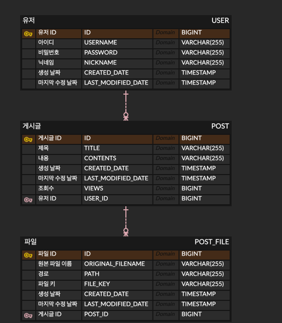

# 간단한 CRUD 게시판

## 학습한 강의

- [김영한의 스프링 부트와 JPA 실무 완전 정복 로드맵](https://www.inflearn.com/roadmaps/149) 

## 주요 기능

- 세션을 이용한 로그인/로그아웃
- 로그인한 사용자 정보 수정
- 글 작성/수정/삭제
- 파일 업로드/삭제

## ERD

## 프레임워크

- Spring
- Spring Boot
- JPA
- Querydsl
- Bootstrap

## DB / 저장소

- H2
- Amazon S3

## 개발 환경

- Mac OS
- IntelliJ IDEA